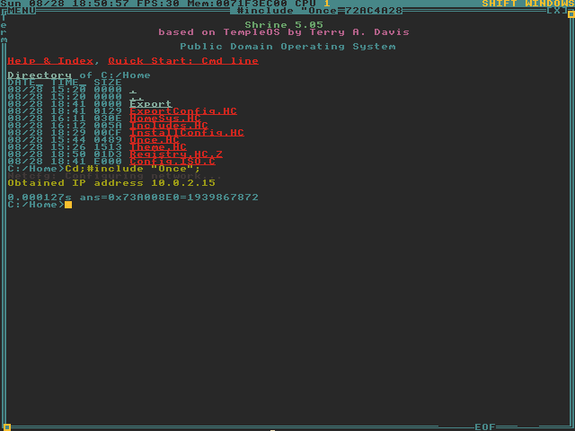

# My config _for ShrineOS 5.05_

### Features
 * Easy installation
 * Included export system
 * Bundled with multiple color schemes

### Installation ([Video](https://streamable.com/aqllxe))
**Note that you have to be running [ShrineOS](https://github.com/minexew/Shrine) in order for this to work**
 * Download the *Config.ISO.C* file and rename it to *Config.ISO*
 * Mount it into your ShrineOS VM and inside ShrineOS using the `Mount` command
 * Navigate to T: drive and include `InstallConfig`
 * Reboot your VM

### Additional functions
 - Exporting your config ([Video](https://streamable.com/r2webn))
    - Navigate to your Home directory and include `ExportConfig`
    - Your config will be exported to *Config.ISO.C*
 - Changing the color scheme ([Video](https://streamable.com/u7heci))
    - Edit the *SYS_THEME* define inside *Theme.HC*[^1]
    - Reboot your VM

[^1]: Available themes are `badwolf, blaquemagick, dracula, gruvdark, gruvlight, nord, soldark and sollight`
